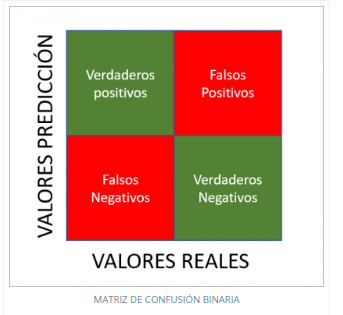

# Configuración de VS Code y librerías en Python

## 1. Seleccionar el intérprete de Conda
Para que VS Code reconozca las librerías de Python:

1. Ve a **View** > **Command Palette**.
2. Escribe y selecciona **Python: Select Interpreter**.
3. Selecciona el entorno de **Conda** que deseas utilizar.

---

## 2. Configurar el atajo para debuguear con `F9`
1. Ve a **File** > **Preferences** > **Keyboard Shortcuts**.
2. Haz clic en el ícono para editar en formato JSON (esquina superior derecha).
3. Agrega el siguiente código al archivo `keybindings.json`:

   ```json
   {
       "key": "f9",
       "command": "python.execSelectionInTerminal",
       "when": "editorTextFocus"
   }

## Matriz de confusión

Esto te mostrará la matriz de confusión, algo como:

[[TP  FN]
 [FP  TN]]




## Explicación de la salida

La matriz de confusión tiene este formato en un problema binario:

| Clase / Predicción       | Predicción Negativa (0)   | Predicción Positiva (1)   |
|---------------------------|---------------------------|---------------------------|
| **Clase Negativa (0)**    | Verdaderos Negativos (TN) | Falsos Positivos (FP)     |
| **Clase Positiva (1)**    | Falsos Negativos (FN)     | Verdaderos Positivos (TP) |

### Definiciones

- **TN (True Negatives):** Ejemplos negativos correctamente clasificados como negativos.
- **FP (False Positives):** Ejemplos negativos clasificados incorrectamente como positivos.
- **FN (False Negatives):** Ejemplos positivos clasificados incorrectamente como negativos.
- **TP (True Positives):** Ejemplos positivos correctamente clasificados como positivos.


## Bibliotecas

- **pyforest**: Simplifica el uso de librerías comunes en ciencia de datos con importaciones automáticas y perezosas.
- **sklearn**: Biblioteca para aprendizaje automático con herramientas para clasificación, regresión, clustering y más.
- **os**: Proporciona funciones para interactuar con el sistema operativo, como manejar directorios y archivos.
- **pandas**: Herramienta poderosa para la manipulación y análisis de datos estructurados en Python.
- **numpy**: Biblioteca fundamental para cálculos numéricos y operaciones con arreglos multidimensionales.
- **graphviz**: Utilidad para crear y visualizar gráficos y diagramas en diversos formatos.
- **xgboost**: Implementación eficiente de gradient boosting, optimizada para rendimiento y escalabilidad.
