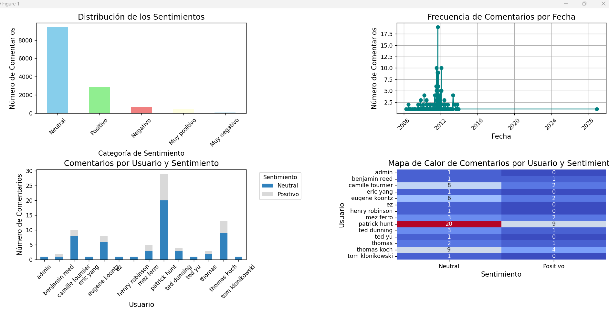
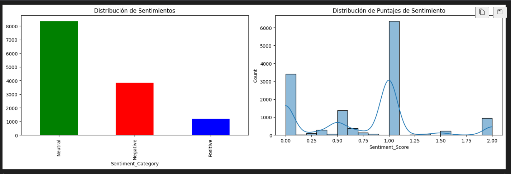

# Información del dataSet

| Propiedad                                            | Descripción                                                                     |
| :--------------------------------------------------- | :------------------------------------------------------------------------------- |
| Número de filas                                     | 13644                                                                            |
| Número de columnas                                  | 3                                                                                |
| Nombres de las columnas                              | ['Comment', 'Benchmark_results_of_politeness', 'Benchmark_results_of_sentiment'] |
| Columnas categóricas                                | ['Comment', 'Benchmark_results_of_politeness']                                   |
| Columnas numéricas                                  | ['Benchmark_results_of_sentiment']                                               |
| ¿Hay columnas duplicadas?                           | False                                                                            |
| Número de filas duplicadas                          | 244                                                                              |
| Valores nulos en 'Comment'                           | 34                                                                               |
| Valores únicos en 'Comment'                         | 13391                                                                            |
| Valores únicos en 'Benchmark_results_of_politeness' | 2                                                                                |
| Valores únicos en 'Benchmark_results_of_sentiment'  | 2428                                                                             |

## Análisis y Limpieza

Se analizan los resultados menos obvios:

* **Benchmark_results_of_politeness**: Solo tiene dos valores POLITE / IMPOLITE
* **Benchmark_results_of_sentiment**: Muestra rango de valores en función de la positividad/negatividad del comentrio, susceptible de categorizar
* **Los valores NaN apenas representan un 0.2%** del dataSet por lo que son susceptibles de 'desaparecer'
* **Para los valores duplicados** se observan que tambien hay alguna incongruencia debido al proceso previo del data set original, hay 238 valores exactamente iguales y 6 con alguna diferencia por lo que se decide también borrar estas filas, que **supone un 1.8% que sumado al 0.2 de NaN anterior supone un total del 2% del total del dataSet, cifra bastante asumible.**

Tras el borrado nos queda un total de 13397 filas

## Tramiento de datos númericos a categóricos

Valores de la columna Valores únicos en 'Benchmark_results_of_sentiment':

| Rango de valores | Frecuencia | Categoría   |
| ---------------- | ---------- | ------------ |
| (-1.003, -0.8]   | 8          | Muy negativo |
| (-0.8, -0.6]     | 36         | Muy negativo |
| (-0.6, -0.4]     | 212        | Negativo     |
| (-0.4, -0.2]     | 484        | Negativo     |
| (-0.2, 0.0]      | 5597       | Neutral      |
| (0.0, 0.2]       | 4008       | Neutral      |
| (0.2, 0.4]       | 2071       | Positivo     |
| (0.4, 0.6]       | 792        | Positivo     |
| (0.6, 0.8]       | 353        | Muy positivo |
| (0.8, 1.0]       | 83         | Muy positivo |

## Estudio y visualización

Revisamos la información y nos centramos en intentar entender y sacar más información de la columna comentarios. Sabiendo que se trata de comenarios técnicos se intenta discriminar información que pueda servirnos para entender el comportatamiento del equipoo, sus roles, expresióne, etc,...

Visualizamos

Profundizamos un poco más en el contexto del dataSet:

* **Frecuencia de palabras** : Entender qué palabras son más recurrentes en los comentarios.
* **Topic Modeling (LDA)** : Identificar los temas recurrentes en los comentarios para comprender mejor las áreas de conversación.
* **Análisis temporal detallado** : Ver cómo la actividad en los comentarios cambia con el tiempo, buscando patrones estacionales o picos.
* **Correlación entre usuarios y sentimientos** : Analizar cómo los comentarios de los usuarios se distribuyen entre los diferentes sentimientos (positivo, negativo, neutral).

**Proceso de Limpieza y Lematización:**

Inicialmente, intentamos utilizar Stanza para la limpieza y lematización de los comentarios. En un equipo local, el proceso completo tardó aproximadamente 4 horas para procesar los 13,600 comentarios. Sin embargo, cuando ejecutamos el mismo proceso en Google Colab utilizando la GPU, el tiempo de ejecución se redujo significativamente a alrededor de 35 minutos.

**Conclusión y Valor Añadido al Dataset:**

Para este ejercicio de examen, verificamos que, al seguir todos los pasos que realizamos, obtenemos resultados consistentes con los datos originales de Kaggle. Además, como valor añadido al dataset, incorporamos información adicional sobre el rango de fechas y los usuarios más activos.

**Análisis Comparativo:**

Tras visualizar los resultados, observamos algunas incongruencias a primera vista entre el análisis de sentimientos del dataset original y el realizado en este ejercicio. Sin embargo, es importante destacar que no todo es lo que parece. A continuación, desglosaré la información resultante, comparando ambos enfoques para ofrecer una visión más detallada y precisa de los resultados.

# **Análisis Comparativo de Sentimientos en Comentarios Técnicos de ITSM (Jira)**

El análisis se centra en comparar dos enfoques utilizados para clasificar los comentarios de usuarios sobre una herramienta de ITSM (Jira):

1. **Análisis de Tono (Polite vs. Unpolite)** :

* El modelo clasifica los comentarios según su  **formalidad y cortesía** .
* La mayoría de los comentarios son **neutrales** en cuanto al tono, reflejando la naturaleza profesional de la comunicación técnica.
* Los comentarios **no corteses** son pocos, lo que es esperado en un entorno técnico donde se mantiene un lenguaje formal, aunque pueden existir frustraciones.

1. **Análisis de Sentimiento (Positivo, Negativo, Neutral)** :

* El análisis de sentimiento muestra una prevalencia de comentarios **neutrales** y  **negativos** .
* Los comentarios negativos son comprensibles en el contexto de ITSM, donde los usuarios a menudo enfrentan problemas o dificultades con la herramienta.
* La **frustración** puede ser implícita en los comentarios, aunque se mantenga un tono formal.

### **Diferencias en los Enfoques**

* El **análisis de tono** mide la cortesía y la **forma** de los comentarios, mientras que el **análisis de sentimiento** mide las emociones subyacentes como  **insatisfacción o frustración** .
* Aunque los técnicos tienden a usar un tono  **cortés y profesional** , los sentimientos negativos surgen cuando los comentarios abordan fallos, errores o dificultades con la herramienta.

### **Conclusiones**

* **El análisis de tono** refleja la **formalidad** de los comentarios, mientras que el **análisis de sentimiento** resalta las emociones, especialmente las **negativas** en un contexto de resolución de problemas.
* La **neutralidad** en los comentarios refleja una comunicación objetiva y técnica, pero los sentimientos negativos son comunes debido a los problemas encontrados en la herramienta.

### **Investigación Futura**

* **Profundizar en las frustraciones técnicas** para entender mejor qué problemas enfrentan los usuarios.
* **Explorar comentarios positivos** para identificar características o funcionalidades que se valoran bien.
* **Implementar un modelo automatizado** que pueda clasificar tanto el tono como el sentimiento de manera más precisa.

Este análisis proporciona una base sólida para entender cómo se comunican los técnicos sobre herramientas de ITSM, destacando tanto el tono formal como las emociones subyacentes, y sugiere líneas de investigación futura.
