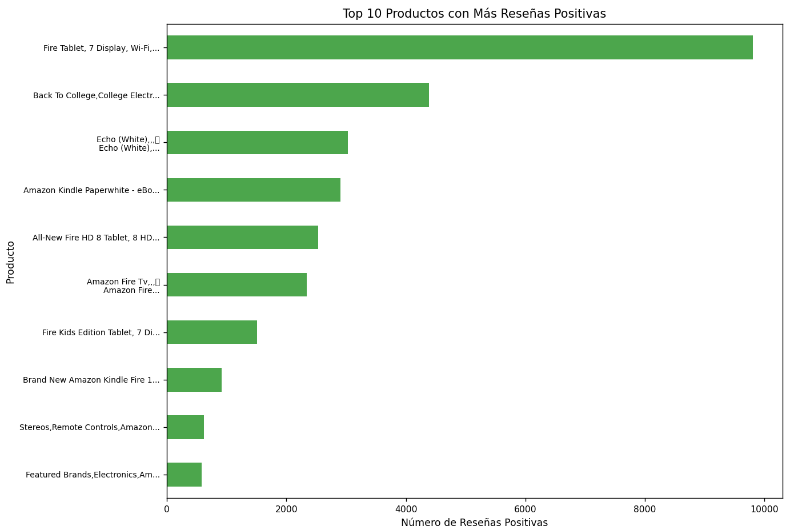
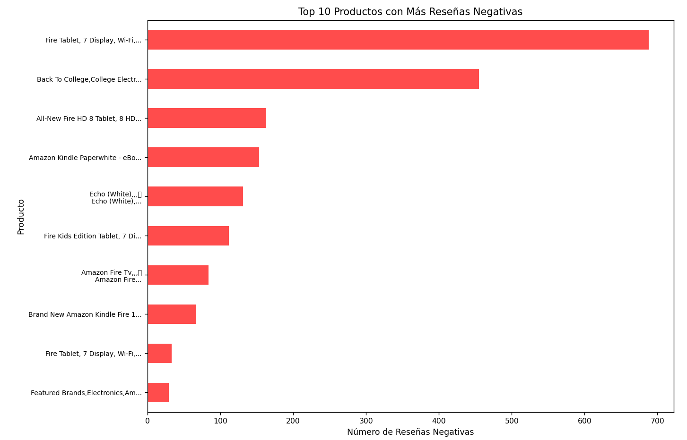
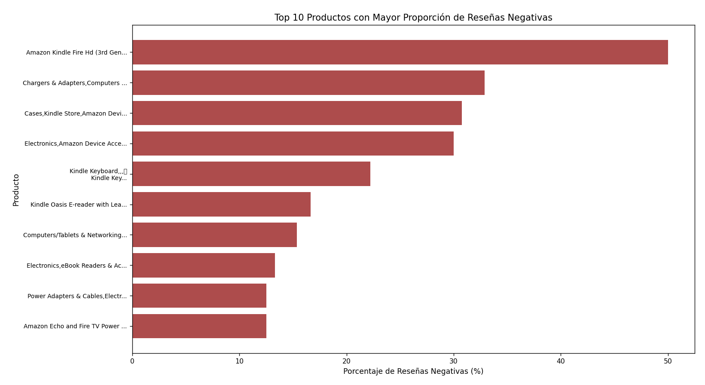
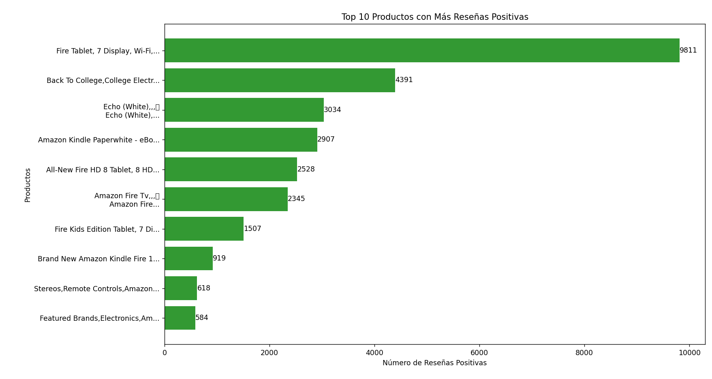
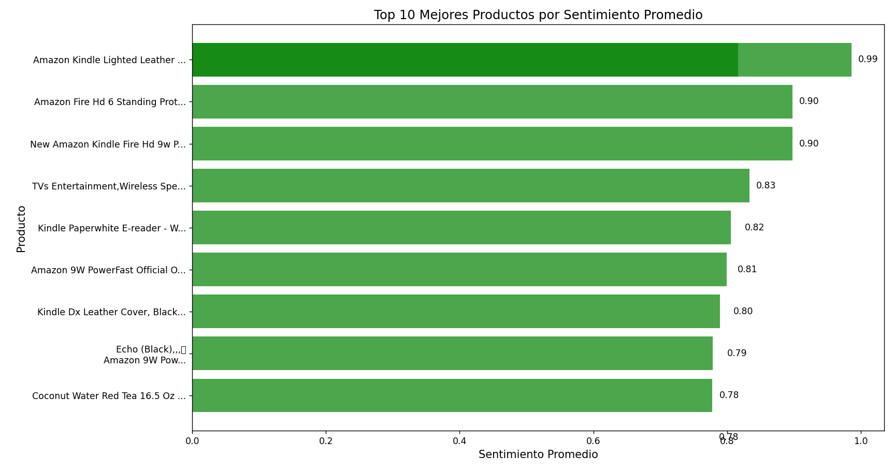
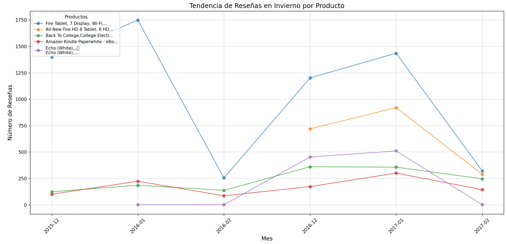
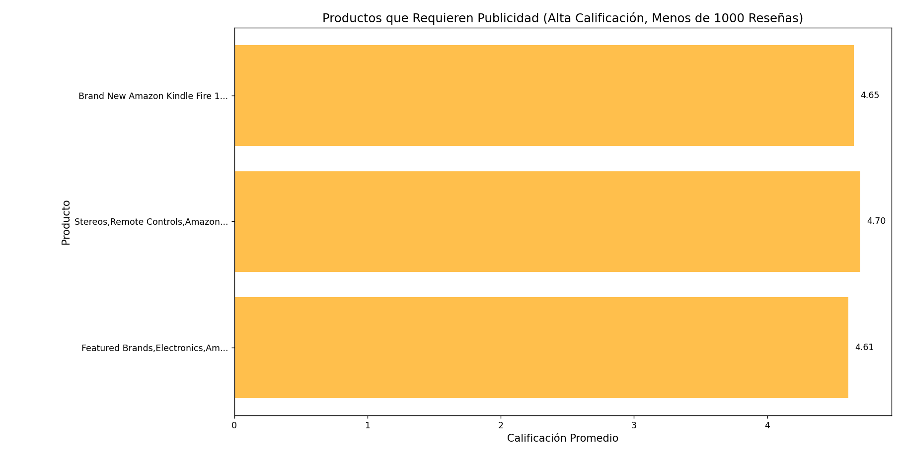

## **Dimensiones del DataFrame**

* **Total de filas** : 34,660
* **Total de columnas** : 21

## **Información del DataFrame (I)**

| **Columna**    | **Tipo de Dato** | **Valores Nulos** | **Valores Únicos** |
| -------------------- | ---------------------- | ----------------------- | ------------------------- |
| id                   | object                 | 0                       | 42                        |
| name                 | object                 | 6760                    | 48                        |
| asins                | object                 | 2                       | 41                        |
| brand                | object                 | 0                       | 6                         |
| categories           | object                 | 0                       | 41                        |
| keys                 | object                 | 0                       | 42                        |
| manufacturer         | object                 | 0                       | 2                         |
| reviews.date         | object                 | 39                      | 1078                      |
| reviews.dateAdded    | object                 | 10,621                  | 1941                      |
| reviews.dateSeen     | object                 | 0                       | 3911                      |
| reviews.didPurchase  | object                 | 34,659                  | 1                         |
| reviews.doRecommend  | object                 | 594                     | 2                         |
| reviews.id           | float64                | 34,659                  | 1                         |
| reviews.numHelpful   | float64                | 529                     | 97                        |
| reviews.rating       | float64                | 33                      | 5                         |
| reviews.sourceURLs   | object                 | 0                       | 11,929                    |
| reviews.text         | object                 | 1                       | 34,659                    |
| reviews.title        | object                 | 6                       | 19,766                    |
| reviews.userCity     | float64                | 34,660                  | 0                         |
| reviews.userProvince | float64                | 34,660                  | 0                         |
| reviews.username     | object                 | 7                       | 26,788                    |

---

## **Detalle Analítico del DataFrame**

Tras analizar las características del dataset, se tomó la decisión de eliminar varias columnas que no aportan valor significativo al análisis de sentimientos. A continuación, se justifican las razones para cada columna eliminada:

1. **`id`** : Es un identificador único con 42 valores distintos. No contiene información semántica ni influye en el análisis del texto de las reseñas.
2. **`asins`** : Representa identificadores únicos de productos, pero esta información ya está representada por la columna `name`, que tiene mayor contexto.
3. **`manufacturer`** : Tiene solo 2 valores únicos, indicando baja variabilidad. No aporta información relevante para el análisis de sentimientos.
4. **`reviews.id`** : Contiene un único valor en todas las filas, lo que la hace completamente irrelevante.
5. **`reviews.sourceURLs`** : Proporciona URLs de las reseñas originales, pero no aporta información semántica ni útil para el análisis de sentimientos.

Se decidió conservar la columna **`reviews.username`** debido a su alta cardinalidad (26,788 valores únicos). Esto puede ser útil para detectar patrones de comportamiento, como la identificación de posibles bots o usuarios con actividad inusual.

Además, se eliminaron las siguientes columnas debido a su alto porcentaje de valores nulos:

* **`reviews.didPurchase`**
* **`reviews.userCity`**
* **`reviews.userProvince`**

Finalmente, las columnas **`reviews.dateAdded`** y **`reviews.dateSeen`** fueron eliminadas porque un tercio de sus valores eran nulos, lo que afecta su utilidad.

---

## **Resumen del DataFrame (II)**

| **Columna**   | **Tipo de Dato** | **Valores NaN** | **Porcentaje NaN** | **Valores Únicos** |
| ------------------- | ---------------------- | --------------------- | ------------------------ | ------------------------- |
| name                | object                 | 0                     | 0.00%                    | 61                        |
| reviews.doRecommend | object                 | 0                     | 0.00%                    | 2                         |
| reviews.numHelpful  | float64                | 0                     | 0.00%                    | 97                        |
| reviews.rating      | float64                | 0                     | 0.00%                    | 5                         |
| reviews.username    | object                 | 0                     | 0.00%                    | 26,788                    |
| reviews.title       | object                 | 0                     | 0.00%                    | 19,766                    |
| brand               | object                 | 0                     | 0.00%                    | 6                         |
| keys                | object                 | 0                     | 0.00%                    | 42                        |
| categories          | object                 | 0                     | 0.00%                    | 41                        |
| reviews.date        | datetime64[ns, UTC]    | 0                     | 0.00%                    | 1,006                     |
| reviews.text        | object                 | 0                     | 0.00%                    | 34,660                    |

---

## **Interpretación**

* **`reviews.dateSeen`** tenía el mayor porcentaje de valores nulos (93.74%) y fue eliminada.
* **`name`** tenía un 19.50% de valores nulos, pero estos fueron tratados con deducción de categorías o un marcador genérico.
* Las columnas sin valores nulos (`brand`, `keys`, `categories`, `reviews.date`, `reviews.text`) están listas para el análisis.

---

## **Clasificación y Conteo de Emojis**

| **Emoji**              | **Sentimiento** | **Frecuencia** |
| ---------------------------- | --------------------- | -------------------- |
| ！                           | Neutral               | 2                    |
| ❤                           | Positivo              | 5                    |
| ☺                           | Neutral               | 5                    |
| ♡♡♡♡♡                   | Neutral               | 1                    |
| ，                           | Neutral               | 2                    |
| ♡♡                         | Neutral               | 1                    |
| ❤❤                         | Positivo              | 1                    |
| ❤️                         | Positivo              | 2                    |
|                            | Neutral               | 2                    |
| ☺️                         | Neutral               | 1                    |
| ���                       | Neutral               | 7                    |
| ������                 | Neutral               | 1                    |
| ️                           | Neutral               | 1                    |
| ！！！！！！！！！！！！！！ | Neutral               | 1                    |

---

# Preguntas de Ejercicio sobre este dataSet:

## 1.-¿Qué productos deben ser mantenidos?

Enfoque: Productos con alto número de reseñas positivas.

Gráfico: Barras con los productos más populares (reseñas positivas).

Los datos muestran que los productos con el mayor número de reseñas positivas son excelentes candidatos para mantenerse en el inventario. En particular, el **"Fire Tablet, 7 Display, Wi-Fi"** lidera con una amplia diferencia, seguido por productos como **"Back to College, College Electronics"** y **"Echo (White)"**

## 2.-¿Qué productos deben ser descartados?

Enfoque: Productos con alto número de reseñas negativas.

Gráfico: Barras con los productos más criticados.

En este gráfico muestra los productos con el mayor número de reseñas negativas. Destaca el  **"Fire Tablet, 7 Display, Wi-Fi"** , seguido por **"Back to College, College Electronics"** y  **"All-New Fire HD 8 Tablet, 8 HD Display"** , como los más criticados.

Estos productos presentan problemas que han generado insatisfacción entre los consumidores, lo que podría sugerir la necesidad de una revisión de su calidad, características o incluso considerar retirarlos del inventario si no se pueden mejorar.

## 3.-¿Qué productos son basura?

Enfoque: Productos con alta proporción de reseñas negativas respecto al total.

Gráfico: Barras mostrando el porcentaje de reseñas negativas por producto.

El gráfico muestra los productos con la mayor proporción de reseñas negativas respecto al total de reseñas. Destaca el  **"Amazon Kindle Fire HD (3rd Gen)"** , seguido por **"Chargers & Adapters, Computers"** y  **"Cases, Kindle Store, Amazon Devices"** , con porcentajes superiores al 30%.

Estos productos tienen un alto nivel de insatisfacción en comparación con la cantidad total de reseñas recibidas, lo que indica problemas significativos que podrían requerir una evaluación detallada de sus características o decisiones sobre su continuidad en el mercado.

## 4-¿Qué producto debería ser recomendado al cliente?

Enfoque: Producto con la mejor calificación promedio y mayor número de reseñas positivas.

Gráfico: Dispersión entre calificación promedio y reseñas positivas.

El análisis muestra que el producto **"Fire Tablet, 7 Display, Wi-Fi"** lidera en número de reseñas positivas (9811) y calificaciones altas. Otros productos destacados incluyen **"Back To College, College Electronics"** y  **"Echo (White)"** , aunque con menos reseñas.

Estos resultados indican que el **"Fire Tablet, 7 Display, Wi-Fi"** debería ser el principal producto recomendado, ya que combina alta popularidad y satisfacción entre los usuarios.

## 5.-¿Cuáles son los mejores productos para los consumidores?

Enfoque: Productos con las calificaciones y sentimientos promedio más altos.

Gráfico: Barras mostrando calificación promedio.

El análisis identifica que el producto **"Amazon Kindle Lighted Leather"** tiene el sentimiento promedio más alto, con una puntuación de 0.99. Otros productos destacados incluyen **"Amazon Fire HD 6 Standing Protector"** y  **"New Amazon Kindle Fire HD 9W"** , ambos con puntuaciones de 0.90.

Estos resultados sugieren que estos productos generan la mayor satisfacción entre los consumidores, posicionándose como las mejores opciones según el sentimiento promedio.

## 6.-¿Qué productos deberían ser planeados para el inventario del próximo invierno?

Enfoque: Productos con alta popularidad en reseñas durante meses de invierno.

Gráfico: Línea temporal mostrando tendencias de reseñas por producto.

El análisis muestra las tendencias de reseñas para los productos más populares durante los meses de invierno. El **"Fire Tablet, 7 Display, Wi-Fi"** destaca con el mayor número de reseñas, especialmente en diciembre de 2016. Otros productos como el **"All-New Fire HD 8 Tablet, 8 HD"** también presentan un incremento constante durante los meses invernales.

Estos productos deberían ser priorizados en el inventario de invierno, ya que demuestran alta demanda en esta temporada específica.

## 7.-¿Qué productos requieren publicidad?

Enfoque: Productos con alta calificación promedio pero pocas reseñas.

Gráfico: Barras mostrando productos prometedores.

Este gráfico destaca los productos con **alta calificación promedio (≥4.5)** pero  **pocas reseñas (menos de 1000)** , indicando su calidad y potencial para captar más atención. Estos productos, como *Brand New Amazon Kindle Fire* y  *Stereos, Remote Controls* , podrían beneficiarse de campañas publicitarias específicas para aumentar su visibilidad y maximizar su rendimiento en el mercado.

